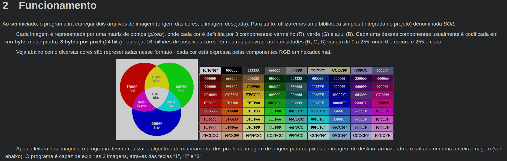
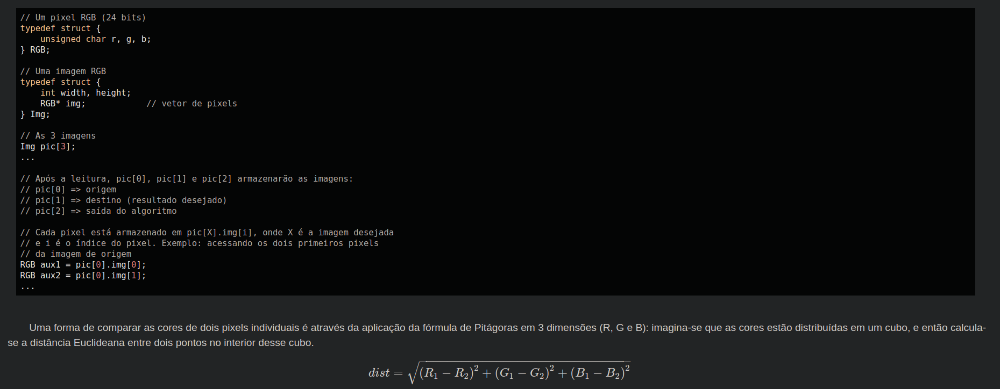
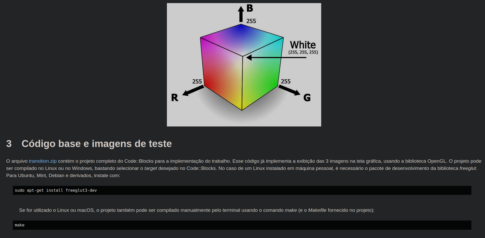

# INFORMAÇÕES PARA ENTENDER O TRABALHO

# Para Rodar o programa

* Baixe o programa **freeglut**: `sudo apt-get install freeglut3-dev`
* Abra o arquivo `.cbp` no **Code Blocks** e Troque para **Linux**
* Clique para rodar no simbolo: 
* Configuração do Code Blocks: 
  * 